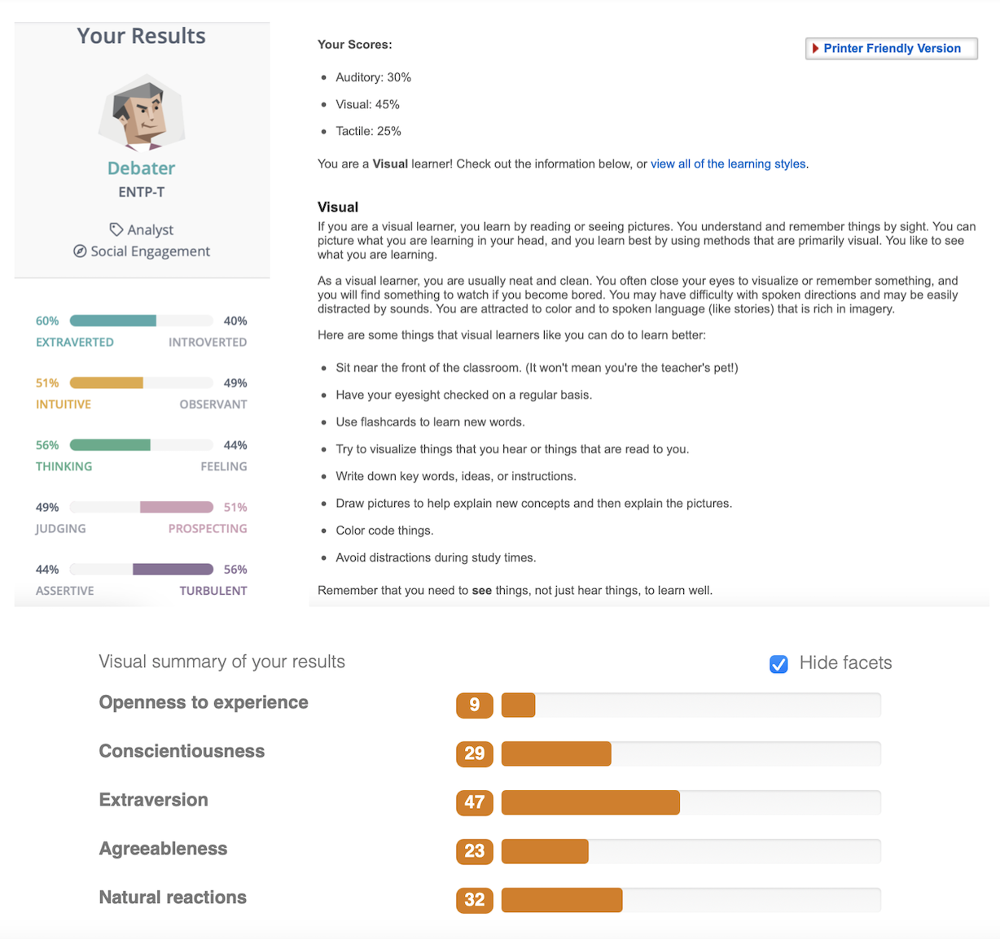
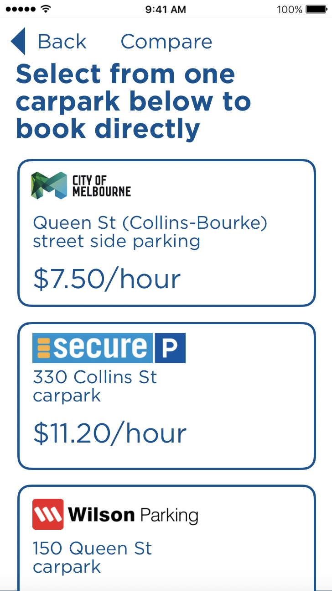

#  Welcome to Duo (George) Cheng's page

## A bit about myself

Hello everyone, my name is Duo (George) Cheng, and I am currently a first year Bachelor of Information Technology student at RMIT. Here's some of my basic details below:   
In the mean time you are welcome to contact me at S3899254@student.rmit.edu.au.

Student ID: S3899254

Previous education: Completion of VCE (Year 12) at Glen Waverley Secondary College in Melbourne's eastern suburbs.

Languages spoken (ranked from most to least): English, Chinese and German

One fun fact about myself: Apart from IT, I also have an active interest in reading the history of Central and Eastern Europe from 1500s, as reflected by my GitHub username, Transcarpathia, which is a region in western Ukraine, formerly part of Austria-Hungary before WWI, and Czechoslovakia before WWII.

Github profile: https://github.com/transcarpathia

Github personal page: https://transcarpathia.github.io/A1-my-profile/

## Interest in IT

**What is your interest in IT?**

I have always been fascinated with computer, which is something that you spend many hours a day on. Many people may not realise this, but your smartphone is a powerful mobile computer that performs faster than a desktop just 3 years ago, while it is much smaller.

**When did your interest in IT start?**

My interest in IT began very long ago, when I started using computers, to browse things and play some games. However, for the coding part, I am only getting started, so more focus on that part is needed.

**Outline your IT experience (if any).**

Everyone had some IT experience even if they don't realise any. The use of mobile phones and computers on a daily basis is a big part of it. Other than that, I've also had some command in coding a simple program, both in Python and Visual Basic (very outdated, but someone will know).

**Why did you choose to come to RMIT?**

RMIT offers an industry-ready experience for every student, especially in IT, where student can put their skills in use in the real world, both during the school life, but also in workplaces post graduation.

**What do you expect to learn during your studies?**

I have always expected to learn advanced coding, in order to create a relatively complex. But also, cyber security to fend off malign actors' attacks on valuable internet properties, such as financial tranactions and private data.

## Ideal job

https://www.seek.com.au/job/51786574?type=standout#searchRequestToken=933e1e64-6e09-452d-911a-9745023071de

This role offered will require the ideal candidate to manage cybersecurity across multiple units, navigating complex web systems used by different sub units of a government department, provide expert IT security advice against malicious activities to the government department, and fend off attacks if necessary.

The skills involved includes tertiary degree in cybersecurity or equivalent, working knowledge of data security standards, as well as considerable prior experience in managing IT risks and provision of IT security advices. Based on my current level, while navigating threats are potentially a simultaneous strength and challenge, I will have to gain deeper understanding of current and emerging information threats, as well as real life experience in managing IT risks, before I can apply for this position.

## Personality test

I have completed 3 personality tests, for other people to gain a clearer understanding of my personality. They are:

1. Myers-Briggs test;
2. Learning style test; and
3. Big Five personality test.

The series of test results has suggested that I am a debater (Myers-Briggs); a visual learner (Learning Style); and more conservative in life experiences (Big Five). Those tests have closely reflected my life experiences to this point, for example, while I am open to working with a team and lead the team in group projects when necessary, however, I also learn better in an environment without distractions (such as a quiet room).

When it comes for forming a team, sharing experiences and making compromise amongst each other will be much appreciated. I do not prefer unilaterally imposing an idea into the project without thorough discussion or consultation. In the mean time, I also like to gather ideas myself (since it creates the best environment for brainstorming) and then share the idea with other members in a group session.

## Project Idea

**Overview**

This project idea is designed to make city parking easier. With tens of thousands coming into Melbourne CBD by car every day, most of them for important business, now they will need a place to park their cars. This mobile app is designed for users to compare prices for each carpark, and allows them to book for a designated spot at any place, so they can save their previous time and not waste it on parking. This app is designed to work on both iOS and Android platform, which means it can be reached by most mobile phone users.

**Motivation**

Finding a car parking space, especially in CBDs of every capital city, can be tough job. Sometimes finding a parking spot not just wastes precious time, but also extra money when you need to enter paid carparks, and left with a big disappointment. Now, it will be a great idea to gather inspiration from restaurant booking apps (since you can book thousands of restaurants in just one platform) and airline apps (choose your seat before flight), apply those inspiration in parking apps, by allowing users to directly book a single parking spot for the hours they desire, at any of the participating carparks.

**Description**

This app will serve as a third-party aggregator for CBD parking (the facilities itself will still be operated by its original owners), allowing its users to save time and money on their CBD parking, find a space on the go, and even pre-book to secure it. From the start to end, it involves the following steps:

Find spaces – Before you can park your car, find the carpark. There are hundreds of privately-owned carparks in Melbourne CBD alone, plus many more street side ones operated by the council. This app will reflect both on the map, giving customers more choices according to their needs.

Spaces available – there are many paid carparks (our main partner) that have installed real time parking info for motorists, however, they are restricted to overhead display only. This app would allow users to check that information on their mobile phones instead, a much more convenient choice. 

Compare prices – The app will reflect the real time price for parking for every available carpark (including council-run street side parking), which can be adjusted anytime based on time of the day, weekday or weekend, as well as demands. Users can lock in the current price for maximum 3 hours before arrival, which may translate into savings for them.

 

_Compare prices for each available carpark, open and transparent_

Booking – the most important aspect. Traditional parking booking systems only allows users to book their desired time, but not a spot. This creates a problem of some motorists being forced to leave the premises due to lack of spaces. With this app, users can lock in their desired spot in advance, allowing them to proceed directly to their pre-booked space instead of driving around to find an available space. The spot will be locked in for 30 minutes after expected arrival time, after then, the user forfeits his/her space and it can be re-allocated. (only available in selected locations)

 

_Book a designated spot with this app_

(Any vehicles that occupies a pre-booked space will trigger an alert as well as a fine determined by operator. This is a third-party platform who does not interfere in carpark management.)

Payment – A page for user to pay for their spot directly on the phone. It can be links to secure mobile payment platforms like Apple Pay and Google Pay, or with other traditional payment methods such as entering credit card. All will be processed securely with enhanced features like Mastercard secure code to minimise any possible security defects. Funds will then be transferred to their respective service provider. Any extra charges/penalties will be dealt directly with the operator.

Go to destination – Working closely with mapping service, such as Google Maps, to embed the location of each available carparks accurately, allows users to transfer the location data to mapping software with a tap.

Extra services – alongside parking, this app can also allow users to pay to book extra services such as car wash on their phone, should users need their car to be cleaned while they’re out for business or leisure. Further integration with other car services may be introduced at a later time.

**Tools and Technologies**

As this software is designed to work across multiple platforms, primarily iOS and Android (which is used by 90% or more Australian mobile phone users combined), a unified coding platform, such as JavaScript, will be a good solution that can reduce the development time, as opposed to writing native codes for both on XCode/Swift (iOS) and Java (Android), though, it comes at the cost of unable to natively integrate this app to either platform. In hardware terms, however, in addition to computers needed for coding, carparks also have to take its load management system online for data to be transmitted onto the phone.

**Skills Required**

This is a grand project to transform city parking, which means many upgrades are necessary apart from the IT team responsible for coding the apps. As mentioned before, current management systems will have to be re-wired and re-coded for internet connectivity, or in some cases, re-installed (mostly older ones). While App writing is an easy process practiced by many developers at this age, physical installation work in carpark facilities will be a challenge, given a large number, upwards of several hundreds, of internet technicians will be required to carry out the work.

In terms of feasibility, while the upfront cost can be high, the costs can be recouped in up to 3 years through increased parking fees and increased carpark usage.

**Outcome**

If successful, this will transform how we park our car in the city, a necessity for many business commuters, and many others who come for entertainment, shopping, dining and education who cannot rely on public transport. Users can get more things done with a simple tap than ever before, even get their cars washed while they are out and about. For parking operators, they will also benefit from increased usage, given some users’ preference would lead them away from parking websites due to its outdated, web only interface. 
